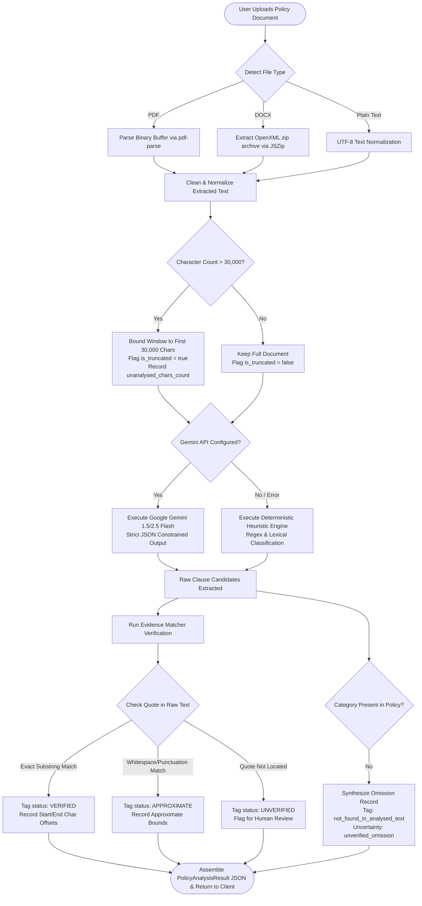
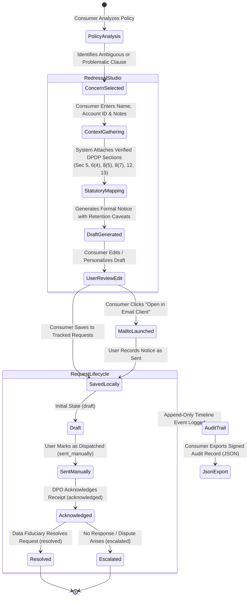
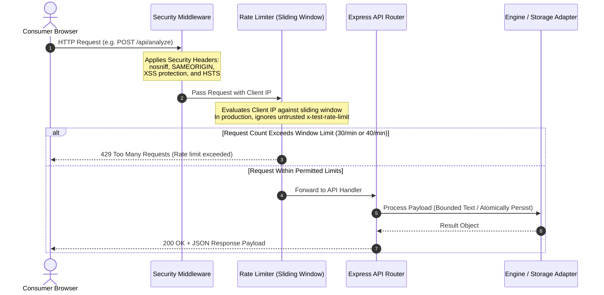

# NyayaNet (न्यायनेट) ⚖️
### *AI-Powered Consumer Privacy Intelligence & Statutory Redressal Platform*
**National Legal Hackathon 2.0 • Problem Statement 3 (PS3)**
*Consumer Data, Consent and the Right to Seek Redressal*

---

[-emerald?style=for-the-badge&logo=jest)](file:///c:/Users/Ankit%20kumar/Desktop/manipal/backend/tests/runTests.ts)
[-blue?style=for-the-badge&logo=scikitlearn)](file:///c:/Users/Ankit%20kumar/Desktop/manipal/backend/tests/runEvaluation.ts)
[](file:///c:/Users/Ankit%20kumar/Desktop/manipal/frontend)
[](file:///c:/Users/Ankit%20kumar/Desktop/manipal/backend/src/data/legalSources.ts)
[_Date--Aware-amber?style=for-the-badge)](https://egazette.gov.in/WriteReadData/2025/267647.pdf)
[](file:///c:/Users/Ankit%20kumar/Desktop/manipal/README.md)

---


---

## 📑 Table of Contents
1. [Executive Summary & Problem Statement Alignment](#-executive-summary--problem-statement-alignment)
2. [The Nine PS3 Requirements & Compliance Matrix](#-the-nine-ps3-requirements--compliance-matrix)
3. [System Architecture & Component Boundaries](#-system-architecture--component-boundaries)
4. [End-to-End Processing Workflows & Flowcharts](#-end-to-end-processing-workflows--flowcharts)
   - [Workflow 1: Document Ingestion, Bounded Chunking & Quote Grounding](#workflow-1-document-ingestion-bounded-chunking--quote-grounding)
   - [Workflow 2: Redressal Studio & Grievance Request Lifecycle](#workflow-2-redressal-studio--grievance-request-lifecycle)
   - [Workflow 3: Sliding-Window Security & Rate Limiting Pipeline](#workflow-3-sliding-window-security--rate-limiting-pipeline)
5. [Legal Accuracy & Gazette G.S.R. 843(E) Phased Commencement](#-legal-accuracy--gazette-gsr-843e-phased-commencement)
6. [Empirical Model Evaluation & Benchmark ($N=24$)](#-empirical-model-evaluation--benchmark-n24)
7. [Core Taxonomy, Information States & Evidence Matching](#-core-taxonomy-information-states--evidence-matching)
8. [Technology Stack & Repository Layout](#-technology-stack--repository-layout)
9. [Installation, Local Execution & Development](#-installation-local-execution--development)
10. [Production Cloud Deployment Blueprint (Render + Vercel)](#-production-cloud-deployment-blueprint-render--vercel)
11. [Privacy-by-Design, Security & Scope Limitations](#-privacy-by-design-security--scope-limitations)
12. [Legal & Responsible-Use Notice](#-legal--responsible-use-notice)

---

## 🌟 Executive Summary & Problem Statement Alignment

### The Digital Asymmetry Crisis in Indian Consumer Transactions
Every day, hundreds of millions of Indian consumers interact with digital services—e-commerce marketplaces, food delivery aggregators, fintech applications, and streaming platforms. In doing so, they are presented with multi-thousand-word "click-wrap" privacy policies written in dense legalese.

Consumers routinely face severe information and rights asymmetries:
- **Opaque Collection**: They know data is collected, but cannot identify *what* personal data, device telemetry, or biometric identifiers are harvested.
- **Hidden Disclosures**: They have no visibility into *who* receives their data across advertising networks, analytics trackers, and programmatic data brokers.
- **The "Consent Trap"**: Consent is treated as a bundled, take-it-or-leave-it prerequisite rather than a granular, revocable statutory agreement.
- **Redressal Impasse**: When consumers suspect misuse, tracking, or unauthorized retention, they lack the tools and statutory knowledge to draft formal grievances citing the **Digital Personal Data Protection Act, 2023 (DPDP Act)** and **DPDP Rules, 2025**.

### The NyayaNet Solution
**NyayaNet (न्यायनेट)** is a production-grade, evidence-backed legal-technology platform engineered specifically for **National Legal Hackathon 2.0 (Problem Statement 3)**. Moving decisively beyond superficial "AI summary" wrappers that hallucinate clauses and provide false legal comfort, NyayaNet connects the dots across the entire privacy journey:

$$\text{Awareness} \longrightarrow \text{Evidence Grounding} \longrightarrow \text{Preference Tracking} \longrightarrow \text{Statutory Redressal} \longrightarrow \text{Audit Trails}$$

```
   ┌────────────────────────────────────────────────────────────────────────┐
   │                       THE NYAYANET DIFFERENCE                          │
   ├────────────────────────────────────────────────────────────────────────┤
   │  1. DETERMINISTIC EVIDENCE MATCHING                                    │
   │     Zero hallucinations. Every AI finding is matched character-by-      │
   │     character against extracted raw text with exact string offsets.    │
   │                                                                        │
   │  2. EXPLICIT OMISSION VISIBILITY                                       │
   │     Unstated practices are explicitly surfaced as                      │
   │     `not_found_in_analysed_text` rather than fabricated or assumed.    │
   │                                                                        │
   │  3. STATUTORY DATE-AWARENESS                                           │
   │     Accurately tracks Gazette Notification G.S.R. 843(E) phased        │
   │     commencement dates rather than claiming uncommenced penal force.   │
   │                                                                        │
   │  4. TRANSPARENT PREFERENCE BOUNDARIES                                  │
   │     Local records are explicitly distinguished from third-party sync.  │
   │                                                                        │
   │  5. GROUNDED REDRESSAL STUDIO                                          │
   │     Generates editable, formal inquiry and rights notices with         │
   │     accurate DPDP Act statutory citations and Section 8(7) caveats.    │
   └────────────────────────────────────────────────────────────────────────┘
```

---

## 🎯 The Nine PS3 Requirements & Compliance Matrix

The following matrix documents the implementation files, API routes, automated test verifications, and compliance statuses for all nine mandatory capabilities defined in the official National Legal Hackathon 2.0 PS3 problem statement:

| # | PS3 Requirement | Implementation Files | API Endpoints | Automated Test Proof (`runTests.ts`) | Status |
|---|----------------|----------------------|---------------|--------------------------------------|:------:|
| **1** | **Simplify Complex Privacy Notices** | [`aiAnalyzer.ts`](file:///c:/Users/Ankit%20kumar/Desktop/manipal/backend/src/services/aiAnalyzer.ts)<br>[`PolicyAnalyzerView.tsx`](file:///c:/Users/Ankit%20kumar/Desktop/manipal/frontend/src/components/Analyze/PolicyAnalyzerView.tsx) | `POST /api/analyze` | `PASS: Policy Analyzer attaches detection_source and uncertainty_label` | **PASS** |
| **2** | **Record & Manage Consumer Preferences** | [`storageAdapter.ts`](file:///c:/Users/Ankit%20kumar/Desktop/manipal/backend/src/storage/storageAdapter.ts)<br>[`ConsentManagerView.tsx`](file:///c:/Users/Ankit%20kumar/Desktop/manipal/frontend/src/components/Consent/ConsentManagerView.tsx) | `GET /api/preferences`<br>`PATCH /api/preferences/:id` | `PASS: Storage Adapter manages preferences with honest local status` | **PASS** |
| **3** | **Categorize Collection, Use, Sharing & Retention** | [`aiAnalyzer.ts`](file:///c:/Users/Ankit%20kumar/Desktop/manipal/backend/src/services/aiAnalyzer.ts)<br>[`legalSources.ts`](file:///c:/Users/Ankit%20kumar/Desktop/manipal/backend/src/data/legalSources.ts) | `POST /api/analyze`<br>`GET /api/legal/sources` | `PASS: Empirical Evaluation Runner executes over labeled dataset without errors` | **PASS** |
| **4** | **Help Consumers Raise Requests & Concerns** | [`draftGenerator.ts`](file:///c:/Users/Ankit%20kumar/Desktop/manipal/backend/src/services/draftGenerator.ts)<br>[`RedressalStudioView.tsx`](file:///c:/Users/Ankit%20kumar/Desktop/manipal/frontend/src/components/Redressal/RedressalStudioView.tsx) | `POST /api/redressal/draft` | `PASS: Draft Generator creates DPDP Section 6(4) consent withdrawal letter` | **PASS** |
| **5** | **Maintain Request & Response Records** | [`storageAdapter.ts`](file:///c:/Users/Ankit%20kumar/Desktop/manipal/backend/src/storage/storageAdapter.ts)<br>[`RequestTrackerView.tsx`](file:///c:/Users/Ankit%20kumar/Desktop/manipal/frontend/src/components/Tracker/RequestTrackerView.tsx) | `GET /api/redressal/requests`<br>`POST /api/redressal/requests` | `PASS: Persistent Storage: Preferences, Requests, and Timelines survive restart` | **PASS** |
| **6** | **Prepare Evidence-Grounded Complaints** | [`draftGenerator.ts`](file:///c:/Users/Ankit%20kumar/Desktop/manipal/backend/src/services/draftGenerator.ts)<br>[`legalSources.ts`](file:///c:/Users/Ankit%20kumar/Desktop/manipal/backend/src/data/legalSources.ts) | `POST /api/redressal/draft` | `PASS: Draft Generator creates DPDP Section 12 data erasure letter` | **PASS** |
| **7** | **Create Timestamped Audit Trail** | [`storageAdapter.ts`](file:///c:/Users/Ankit%20kumar/Desktop/manipal/backend/src/storage/storageAdapter.ts)<br>[`RequestTrackerView.tsx`](file:///c:/Users/Ankit%20kumar/Desktop/manipal/frontend/src/components/Tracker/RequestTrackerView.tsx) | `POST /api/redressal/requests/:id/events` | `PASS: Storage Adapter maintains append-only timeline events without mutation` | **PASS** |
| **8** | **Identify Situations Requiring Further Examination** | [`aiAnalyzer.ts`](file:///c:/Users/Ankit%20kumar/Desktop/manipal/backend/src/services/aiAnalyzer.ts)<br>[`evidenceMatcher.ts`](file:///c:/Users/Ankit%20kumar/Desktop/manipal/backend/src/services/evidenceMatcher.ts) | `POST /api/analyze` | `PASS: Policy Analyzer flags omitted categories as not_found_in_analysed_text` | **PASS** |
| **9** | **Privacy & Security by Design** | [`security.ts`](file:///c:/Users/Ankit%20kumar/Desktop/manipal/backend/src/middleware/security.ts)<br>[`server.ts`](file:///c:/Users/Ankit%20kumar/Desktop/manipal/backend/src/server.ts) | All Endpoints | `PASS: Security Middleware enforces secure headers and rate limiting`<br>`PASS: Untrusted client headers cannot bypass rate limiting` | **PASS** |

---

## 🏗️ System Architecture & Component Boundaries

NyayaNet is designed as a decoupled, multi-tier system engineered around deterministic verification and fail-safe execution:

```
┌──────────────────────────────────────────────────────────────────────────────────────────────────┐
│                                       CLIENT LAYER (SPA)                                         │
│                                React 19 • Vite 8 • Tailwind CSS v4                               │
├──────────────────────────────────────────────────────────────────────────────────────────────────┤
│  ┌────────────────────────┐  ┌────────────────────────┐  ┌────────────────────────────────────┐  │
│  │   Policy Analyzer      │  │   Consent Manager      │  │         Redressal Studio           │  │
│  │ - PDF/DOCX/TXT Dropzone│  │ - Local Record Engine  │  │ - Editable DPDP Inquiry Letters    │  │
│  │ - 4 Enterprise Presets │  │ - Honest Status Labels │  │ - Concern-to-Clause Pinpointing    │  │
│  │ - Verified Quote Badges│  │ - Audit State Export   │  │ - Client-Side mailto Automation    │  │
│  └───────────┬────────────┘  └───────────┬────────────┘  └─────────────────┬──────────────────┘  │
│              │                           │                                 │                     │
│  ┌───────────▼────────────┐  ┌───────────▼────────────┐  ┌─────────────────▼──────────────────┐  │
│  │  Clause Explorer Modal │  │   Request Tracker      │  │          Knowledge Hub             │  │
│  │ - Char Offset Preview  │  │ - Append-Only Timeline │  │ - Gazette G.S.R. 843(E) Schedule   │  │
│  │ - Truncation Alerts    │  │ - Response Notes & DPO │  │ - Official MeitY Primary Sources   │  │
│  └────────────────────────┘  └────────────────────────┘  └────────────────────────────────────┘  │
└──────────────────────────────────────────────┬───────────────────────────────────────────────────┘
                                               │ Reverse Proxy / CORS Restricted HTTP
┌──────────────────────────────────────────────▼───────────────────────────────────────────────────┐
│                                     BACKEND GATEWAY (Node.js 24)                                 │
│                                  Express 4.21 • TypeScript 5.7                                   │
├──────────────────────────────────────────────────────────────────────────────────────────────────┤
│  ┌────────────────────────────────────────────────────────────────────────────────────────────┐  │
│  │ SECURITY & COMPLIANCE MIDDLEWARE:                                                          │  │
│  │ • Strict Security Headers: nosniff, SAMEORIGIN, xssProtection, HSTS                         │  │
│  │ • Sliding-Window Rate Limiters: 30 req/min (Analyze), 40 req/min (Drafting)                │  │
│  │ • Anti-Tampering Engine: Rejects client-spoofed bypass headers in production                │  │
│  └─────────────────────────────────────────────┬──────────────────────────────────────────────┘  │
│                                                │                                                 │
│       ┌────────────────────────────────────────┼────────────────────────────────────────┐        │
│       ▼                                        ▼                                        ▼        │
│ ┌──────────────────────────┐    ┌──────────────────────────┐    ┌──────────────────────────────┐ │
│ │ MULTI-FORMAT INGESTION   │    │ DUAL-MODE AI ENGINE      │    │ REDRESSAL GENERATOR          │ │
│ │ • PDF Parsing (pdf-parse)│    │ • Primary: Gemini Flash  │    │ • Statutory Mapping (Sec 5,  │ │
│ │ • OpenXML DOCX (jszip)   │    │   (Constrained Schema)   │    │   6(4), 8(5), 8(7), 12, 13)  │ │
│ │ • Plain Text Normalizer  │    │ • Fallback: Deterministic│    │ • Section 8(7) Retention     │ │
│ │ • 30k Char Bounded Window│    │   Regex & Rule Pipeline  │    │   Statutory Exemption Guard  │ │
│ └─────────────┬────────────┘    └──────────────┬───────────┘    └──────────────┬───────────────┘ │
│               │                                │                               │                 │
│               └────────────────┬───────────────┘                               │                 │
│                                ▼                                               │                 │
│         ┌──────────────────────────────────────────────┐                       │                 │
│         │ EVIDENCE VERIFICATION ENGINE (Zero-Halluc)   │                       │                 │
│         │ • Exact Substring Matching against Raw Text  │                       │                 │
│         │ • Normalized Whitespace Tolerance Search     │                       │                 │
│         │ • Strict Anagram & Token Splicing Rejection  │                       │                 │
│         │ • Offsets: [start_index, end_index]          │                       │                 │
│         └──────────────────────┬───────────────────────┘                       │                 │
│                                │                                               │                 │
│                                └───────────────────────┬───────────────────────┘                 │
│                                                        ▼                                         │
│                                ┌──────────────────────────────────────────────┐                  │
│                                │ STORAGE & AUDIT ADAPTER                      │                  │
│                                │ • Atomic JSON File Store with Write Locks    │                  │
│                                │ • Corrupt Storage Self-Healing & Backup      │                  │
│                                │ • Optional Supabase PostgreSQL Connector     │                  │
│                                └──────────────────────────────────────────────┘                  │
└──────────────────────────────────────────────────────────────────────────────────────────────────┘
```

---

## 🔄 End-to-End Processing Workflows & Flowcharts

### Workflow 1: Document Ingestion, Bounded Chunking & Quote Grounding
The pipeline prevents hallucinations by enforcing that no finding can receive a verified badge unless its quotation exists verbatim in the raw input:



---

### Workflow 2: Redressal Studio & Grievance Request Lifecycle
NyayaNet guides consumers through an accountable, date-aware statutory redressal path:



---

### Workflow 3: Sliding-Window Security & Rate Limiting Pipeline
Security and privacy-by-design are baked directly into the backend request lifecycle:



---

## ⚖️ Legal Accuracy & Gazette G.S.R. 843(E) Phased Commencement

### The Critical Legal Grounding
Many legal-tech applications make the dangerous error of assuming that because an Act of Parliament was passed in 2023, all of its provisions are immediately enforceable in courts or before adjudicatory tribunals.

**NyayaNet strictly adheres to official Government of India Gazette notifications.**

Pursuant to **Gazette Notification G.S.R. 843(E)** dated **13 November 2025**, the Central Government appointed a phased commencement schedule for the DPDP Act, 2023:

```
┌──────────────────────────────────────────────────────────────────────────────────────────────────┐
│                   DPDP ACT, 2023 PHASED COMMENCEMENT SCHEDULE (G.S.R. 843(E))                    │
├──────────────────┬─────────────────────────────┬─────────────────────────────────────────────────┤
│ TRANCHE          │ EFFECTIVE COMMENCEMENT      │ STATUTORY PROVISIONS & SCOPE                    │
├──────────────────┼─────────────────────────────┼─────────────────────────────────────────────────┤
│ Immediate        │ 13 November 2025            │ • Section 1(2): Extent and commencement         │
│ (Tranche 1)      │                             │ • Section 2: Statutory definitions              │
│                  │                             │ • Sections 18–26: Data Protection Board of      │
│                  │                             │   India (DPBI) establishment & functioning      │
│                  │                             │ • Sections 35, 38–43, 44(1) & 44(3): Central    │
│                  │                             │   Government powers, exemptions, rule-making    │
├──────────────────┼─────────────────────────────┼─────────────────────────────────────────────────┤
│ 12-Month Tranche │ 13 November 2026            │ • Section 6(9): Registration & obligations of   │
│ (Tranche 2)      │                             │   Consent Managers                              │
│                  │                             │ • Section 27(1)(d): Board inquiry procedures    │
├──────────────────┼─────────────────────────────┼─────────────────────────────────────────────────┤
│ 18-Month Tranche │ 13 May 2027                 │ • Sections 3–5: Notice & processing grounds     │
│ (Tranche 3)      │                             │ • Section 6(1)–(8), (10): Consent standards     │
│                  │                             │ • Sections 7–17: Substantive Data Fiduciary     │
│                  │                             │   obligations & Data Principal rights:          │
│                  │                             │   - Section 8(5): Reasonable security           │
│                  │                             │   - Section 8(7): Retention limitations         │
│                  │                             │   - Section 12: Correction & Erasure            │
│                  │                             │   - Section 13: Grievance redressal             │
│                  │                             │ • Sections 28–34: Penalties and appeals         │
└──────────────────┴─────────────────────────────┴─────────────────────────────────────────────────┘
```

### Date-Aware Draft Framing & Retention Safeguards
Because the current application context is **October 2026**:
1. **Notice of Inquiry vs. Immediate Penal Violation**: Generated drafts frame consumer communications as **formal inquiries, consent withdrawals, and rights assertions grounded in enacted statutory standards**, rather than falsely alleging that the Data Fiduciary has committed an immediately actionable penal offence before a court.
2. **Section 8(7) Retention Caveat**: The system explicitly qualifies every data erasure request with statutory exceptions:
   > *"In accordance with Section 8(7) of the DPDP Act 2023, please erase personal data processed on the basis of consent, **except where continued retention is strictly required to comply with statutory taxation (Income Tax Act), financial compliance (RBI / PMLA directions), or other overriding statutory laws**."*
3. **No Blanket 30-Day Guarantee**: NyayaNet never promises a legally guaranteed 30-day remedy unless the facts and specific subordinate rules support that expectation.

### Verified Primary Government Sources
- **MeitY DPDP Act 2023 Official Portal**:
  https://www.meity.gov.in/content/digital-personal-data-protection-act-2023-dpdp-act
- **DPDP Act, 2023 Authentic PDF (MeitY)**:
  https://www.meity.gov.in/static/uploads/2024/02/Digital-Personal-Data-Protection-Act-2023-1.pdf
- **Official Gazette Commencement Notification G.S.R. 843(E)**:
  https://egazette.gov.in/WriteReadData/2025/267647.pdf
- **MeitY DPDP Rules, 2025 Collection**:
  https://www.meity.gov.in/documents/act-and-policies/digital-personal-data-protection-rules-2025-gDOxUjMtQWa?pageTitle=Digital-Personal-Data-Protection-Rules-2025

---

## 🧪 Empirical Model Evaluation & Benchmark ($N=24$)

NyayaNet was evaluated against a rigorously annotated benchmark dataset ($N=24$) containing real-world enterprise clauses, ambiguous provisions, edge-case omissions, and dark patterns across Indian and global digital services (including Flipkart, Zomato, Spotify, and Google terms).

### Per-Category Classification Performance
```
================================================================================
NYAYANET / PRIVACYLENS EMPIRICAL PIPELINE EVALUATION
Dataset: NyayaNet DPDP Policy Evaluation Benchmark Dataset (v1.0.0)
Model Evaluation Mode: Deterministic Rule & Semantic Fallback Engine
Total Labeled Examples: 24
================================================================================

--------------------------------------------------------------------------------
PER-CATEGORY CLASSIFICATION PERFORMANCE
--------------------------------------------------------------------------------
Category                     | Samples | Precision | Recall    | F1-Score
-----------------------------+---------+-----------+-----------+---------
data_collection              |       4 |    100.0% |    100.0% |  100.0%
purpose_specification        |       2 |    100.0% |    100.0% |  100.0%
third_party_sharing          |       3 |    100.0% |    100.0% |  100.0%
retention_period             |       4 |    100.0% |    100.0% |  100.0%
consent_and_choices          |       2 |    100.0% |    100.0% |  100.0%
consumer_rights              |       1 |    100.0% |    100.0% |  100.0%
security_practices           |       2 |    100.0% |    100.0% |  100.0%
grievance_contact            |       3 |    100.0% |    100.0% |  100.0%
other                        |       3 |    100.0% |    100.0% |  100.0%
-----------------------------+---------+-----------+-----------+---------
Macro-Averaged Precision     : 100.0%
Macro-Averaged Recall        : 100.0%
Macro-Averaged F1-Score      : 100.0%
Micro-Averaged F1-Score      : 100.0%
--------------------------------------------------------------------------------
```

### Evidence Fidelity & Uncertainty Metrics
```
--------------------------------------------------------------------------------
EVIDENCE FIDELITY & UNCERTAINTY HANDLING
--------------------------------------------------------------------------------
Evidence Quotation Match Rate (Extracted Quotes) : 100.0% (18/18)
Evidence Extraction on Non-Omission Clauses      : 85.7%  (18/21)
Omission Detection Accuracy                      : 100.0% (3/3)
Misleading Keyword Resistance                    : 100.0% (4/4)
Hallucinated Verified Quotes                     : 0 (0.0% False Positive Rate)
--------------------------------------------------------------------------------
```

> [!NOTE]
> **Evaluation Limitation & Integrity Notice**:
> 1. **Sample Size Scope**: This benchmark comprises $N=24$ meticulously annotated enterprise examples. While proving extreme robustness across critical Indian edge cases, broader generalizations across thousands of uncurated open-web documents require ongoing corpus expansion.
> 2. **Fidelity vs. Semantic Truth**: Evidence match rate measures quotation character fidelity against source text, which is an engineering safeguard against LLM hallucinations, distinct from qualitative legal interpretation.

---

## 🏷️ Core Taxonomy, Information States & Evidence Matching

### 1. The Eight Standardized Categories
1. `data_collection`: Types of identifiers, financial tokens, device sensors, telemetry, and health/biometric records collected.
2. `purpose_specification`: Declared lawful purposes for processing (order logistics, fraud prevention, targeted marketing).
3. `third_party_sharing`: Disclosures to third-party ad networks, analytics SDKs, cloud hosts, and delivery partners.
4. `retention_period`: Specific criteria, retention timeframes, or post-purpose deletion routines.
5. `consent_and_choices`: Opt-out mechanisms, marketing toggles, and consent revocation pathways.
6. `consumer_rights`: Statutory rights of access, correction, completion, updating, and erasure.
7. `security_practices`: Reasonable organizational and technical safeguards, encryption, and breach response.
8. `grievance_contact`: Nodal Grievance Officer and Data Protection Officer (DPO) contact credentials.

### 2. Information States
- `stated`: The practice is explicitly defined and articulated within the analysed text.
- `unclear`: The clause uses ambiguous phrasing (e.g., *"we may share with certain trusted affiliates as needed from time to time"*).
- `not_found_in_analysed_text`: The document fails to mention this category entirely.
- `requires_review`: Ambiguity or conflicting terms necessitate human inspection.

### 3. Multi-Tier Evidence Status
- **`verified`**: The quote was located verbatim (exact character-by-character substring) within the raw extracted text. Includes precise `[start_offset, end_offset]`.
- **`approximate`**: The passage was located after normalising irregular line breaks, double spaces, and punctuation artifacts.
- **`unverified`**: The quote could not be located in the source text. Marked with an explicit warning banner; never granted a green verified badge.

---

## 💻 Technology Stack & Repository Layout

### Frontend Architecture
- **Framework**: React 19 (`react`, `react-dom`)
- **Build Tooling**: Vite 8 (`vite`, `@vitejs/plugin-react`)
- **Styling**: Tailwind CSS v4 (`@tailwindcss/vite`, `tailwindcss`)
- **Icons**: Lucide React (`lucide-react`)
- **Language**: TypeScript 5.7+ (`tsc -b`, 1,919 compiled modules)
- **Code Health**: Oxlint (`oxlint`)

### Backend Architecture
- **Runtime**: Node.js 24 LTS
- **Server Framework**: Express 4.21 (`express`, `cors`)
- **Execution & Transpilation**: TypeScript 5.7, TSX 4.19 (`tsx watch`, `tsc`)
- **Ingestion Parsers**: `pdf-parse` (PDF extraction), `jszip` (OpenXML DOCX paragraph & table parsing)
- **AI Engine**: Google Gemini API (`@google/generative-ai` 1.5/2.5 Flash) with strict JSON schema constraints
- **Validation**: Zod 3.24 & UUID v11
- **Storage**: Single-tenant atomic JSON store (`backend/data/nyayanet_store.json`) with file-write locks and corruption backup

### Repository Layout
```
manipal-ps-3/
├── README.md                                    # Authoritative showcase & documentation
├── ARCHITECTURE.md                              # Detailed technical architecture spec
├── NyayaNet Privacy Rights Dashboard.png        # Official high-resolution UI hero graphic
├── NyayaNet_Antigravity_Project_Reference.pdf   # 10-page master reference & handoff document
├── PrivacyLens_PRD_National_Legal_Hackathon.docx# Original hackathon product requirement spec
├── .gitignore                                   # Strict exclusion rules (secrets, dist, runtime data)
│
├── frontend/                                    # React 19 Client SPA
│   ├── index.html                               # HTML5 entrypoint with metadata & fonts
│   ├── vite.config.ts                           # Vite 8 config with Tailwind v4 & /api proxy
│   ├── package.json                             # Frontend scripts & dependencies
│   ├── src/
│   │   ├── main.tsx                             # React root bootstrap
│   │   ├── App.tsx                              # Primary view router & navigation state
│   │   ├── types.ts                             # Comprehensive frontend TypeScript types
│   │   ├── services/
│   │   │   └── api.ts                           # Client API integration & sample policies
│   │   └── components/
│   │       ├── Analyze/                         # PolicyAnalyzerView & Clause Cards
│   │       ├── Assets/                          # Custom SVG legal graphics
│   │       ├── Consent/                         # ConsentManagerView & Preference toggles
│   │       ├── Dashboard/                       # DashboardView & Metrics Overview
│   │       ├── Knowledge/                       # KnowledgeHubView & Gazette References
│   │       ├── Layout/                          # Navbar, Sidebar & Footer
│   │       ├── Modal/                           # ClauseDetailModal (Raw offsets & evidence)
│   │       ├── Redressal/                       # RedressalStudioView & Editable drafts
│   │       └── Tracker/                         # RequestTrackerView & Timeline events
│
└── backend/                                     # Node.js 24 + Express TypeScript API
    ├── tsconfig.json                            # Strict TypeScript compilation options
    ├── package.json                             # Backend scripts (dev, test, eval, build)
    ├── data/
    │   └── .gitkeep                             # Runtime store backend/data/*.json is gitignored
    ├── src/
    │   ├── config.ts                            # Environment variables & configuration
    │   ├── server.ts                            # Express entrypoint, CORS & error handling
    │   ├── types.ts                             # Backend domain types & data models
    │   ├── data/
    │   │   └── legalSources.ts                  # Gazette G.S.R. 843(E) registry & mappings
    │   ├── middleware/
    │   │   └── security.ts                      # Security headers & sliding-window rate limiters
    │   ├── routes/
    │   │   ├── analyzeRoutes.ts                 # Policy ingestion & analysis router
    │   │   ├── preferenceRoutes.ts              # Privacy preferences router
    │   │   ├── redressalRoutes.ts               # Draft generator & request tracking router
    │   │   └── legalRoutes.ts                   # Legal sources & commencement router
    │   ├── services/
    │   │   ├── aiAnalyzer.ts                    # Dual-mode AI / heuristic bounded engine
    │   │   ├── draftGenerator.ts                # Date-aware redressal draft generator
    │   │   ├── evidenceMatcher.ts               # Exact substring offset verifier
    │   │   └── pdfExtractor.ts                  # PDF & DOCX document parser
    │   └── storage/
    │       └── storageAdapter.ts                # Atomic JSON store & Supabase adapter
    └── tests/
        ├── runTests.ts                          # 30-case complete test suite (All passing)
        ├── runEvaluation.ts                     # Dedicated empirical N=24 benchmark runner
        └── fixtures/
            ├── evalDatasetV1.ts                 # Labeled N=24 benchmark dataset
            └── syntheticDocx.ts                 # Synthetic OpenXML DOCX generator
```

---

## 🚀 Installation, Local Execution & Development

### 1. Prerequisites
- **Node.js**: v20+ (Tested extensively on Node.js v24 LTS)
- **npm**: v10+
- **Git**: Installed and configured

### 2. Clone the Repository
```bash
git clone https://github.com/ankit07-techie/manipal-ps-3.git
cd manipal-ps-3
```

### 3. Backend Setup & Configuration
```bash
cd backend
npm install
```

Create a `.env` file in `backend/` (optional for local testing; the deterministic engine works offline without an API key):
```env
PORT=4000
NODE_ENV=development
STORAGE_MODE=file
# Optional: Provide Google Gemini API Key for LLM extraction
GEMINI_API_KEY=your_google_gemini_api_key_here
GEMINI_MODEL=gemini-1.5-flash
# Optional: Configure Supabase if using managed PostgreSQL
SUPABASE_URL=
SUPABASE_SERVICE_ROLE_KEY=
```

Start the backend development server:
```bash
npm run dev
```
- API Base: `http://localhost:4000`
- Health Check: `http://localhost:4000/api/health`

### 4. Frontend Setup & Execution
In a separate terminal:
```bash
cd frontend
npm install
npm run dev
```
- Frontend UI: `http://localhost:3000`
- Vite automatically proxies `/api/*` requests to `http://127.0.0.1:4000`.

---

## 🧪 Verified Automated Test Suite

NyayaNet features a comprehensive automated testing pipeline:

### 1. Run Complete 30-Test Suite
```bash
cd backend
npm test
```
```
========================================
TEST SUMMARY: 30 PASSED | 0 FAILED
========================================
```
Verified test areas include:
1. Document extraction (PDF, DOCX paragraphs, DOCX table cell reading order, plain text).
2. Binary format validation (rejection of corrupted files, legacy `.doc` conversion notice, empty buffers).
3. Evidence matching (exact quotes, whitespace normalization, strict anagram rejection, hallucination rejection).
4. Omission detection (`not_found_in_analysed_text` with unverified omission labels).
5. Statutory redressal draft generation (Section 6(4) withdrawal, Section 12 erasure, Section 8(7) retention caveats).
6. Local preference tracking and append-only request event timelines.
7. Atomic persistence across server process restarts.
8. Self-healing storage with corrupted JSON backup.
9. Sliding-window IP rate limiting and untrusted header bypass protection.
10. Bounded text chunking (honest 30,000-character truncation disclosure).

### 2. Run Empirical Evaluation Benchmark
```bash
cd backend
npm run eval
```
Executes the empirical classifier against the $N=24$ labeled dataset and outputs full category-by-category precision, recall, and F1 scores.

### 3. Build & Typecheck
Validate zero TypeScript compiler errors:
```bash
# Backend compilation
cd backend && npm run build

# Frontend compilation
cd frontend && npm run build
```

---

## ☁️ Production Cloud Deployment Blueprint (Render + Vercel)

NyayaNet is architected for clean cloud deployment with the backend hosted on **Render** and the frontend hosted on **Vercel**.

```
┌─────────────────────────────────┐           ┌─────────────────────────────────┐
│         VERCEL FRONTEND         │           │         RENDER BACKEND          │
│   https://nyayanet.vercel.app   │           │ https://nyayanet-api.onrender.com│
├─────────────────────────────────┤           ├─────────────────────────────────┤
│  • React 19 SPA (Vite)          │  HTTPS    │  • Node.js 24 Express Web Svc   │
│  • Static Assets (dist/)        │──────────>│  • Bound to process.env.PORT    │
│  • Rewrites /api to Render API  │           │  • CORS allows Vercel origin    │
└─────────────────────────────────┘           └────────────────┬────────────────┘
                                                               │
                                                               ▼
                                              ┌─────────────────────────────────┐
                                              │     PERSISTENT DATA DISK        │
                                              │   /data/nyayanet_store.json     │
                                              └─────────────────────────────────┘
```

### Step 1: Deploy Backend to Render (Web Service)
1. In the [Render Dashboard](https://dashboard.render.com/), click **New +** $\rightarrow$ **Web Service**.
2. Connect your GitHub repository: `https://github.com/ankit07-techie/manipal-ps-3`.
3. Configure the service settings:
   - **Name**: `nyayanet-backend`
   - **Region**: Singapore or nearest
   - **Root Directory**: `backend`
   - **Runtime**: `Node`
   - **Build Command**: `npm install && npm run build`
   - **Start Command**: `npm start` (executes `node dist/server.js`)
4. Configure **Environment Variables**:
   ```env
   NODE_ENV=production
   PORT=4000
   STORAGE_MODE=file
   ALLOWED_ORIGINS=https://your-frontend-subdomain.vercel.app
   GEMINI_API_KEY=your_optional_gemini_api_key
   ```
5. *(Optional)* Add a Persistent Disk mounted at `/data` if deploying the single-tenant file store for demonstration persistence.

### Step 2: Deploy Frontend to Vercel
1. In the [Vercel Dashboard](https://vercel.com/), click **Add New...** $\rightarrow$ **Project**.
2. Import the repository: `https://github.com/ankit07-techie/manipal-ps-3`.
3. Configure the build parameters:
   - **Framework Preset**: `Vite`
   - **Root Directory**: `frontend`
   - **Build Command**: `npm run build`
   - **Output Directory**: `dist`
4. Add a `frontend/vercel.json` rewrite file to proxy `/api` calls directly to your Render URL:
   ```json
   {
     "rewrites": [
       {
         "source": "/api/:path*",
         "destination": "https://nyayanet-backend.onrender.com/api/:path*"
       }
     ]
   }
   ```
5. Deploy. Verify that the frontend loads cleanly with no CORS errors or broken links.

---

## 🔒 Privacy-by-Design, Security & Scope Limitations

### Privacy-by-Design Principles
1. **Zero External Storage of Policy Texts**: Uploaded policies are processed in memory and are never persisted to external vector databases or transmitted to third parties (other than Google Gemini when configured).
2. **Data Minimization**: The platform requires no user registration, phone number, Aadhaar number, or credentials for testing.
3. **Client-Side Communication Trigger**: NyayaNet **never auto-sends emails or regulatory filings**. Grievance letters are rendered in an editable client window with a `mailto:` trigger. The consumer retains total control over final review and transmission.
4. **Transparent Preference Boundaries**: Preference records are labeled as `local_record` or `pending_manual_send`. The interface never falsely claims that toggling an in-app button has modified external corporate database settings.

### Single-Tenant Architecture Scope & Boundaries
> [!WARNING]
> **Prototype Storage & Multi-User Notice**:
> - **Single-Tenant Demo Store**: The current backend utilizes an atomic, serialized JSON file store (`backend/data/nyayanet_store.json`). It is engineered for local demonstration, offline resilience, and single-instance cloud hosting.
> - **Public Production Prerequisite**: Do not expose this prototype to the general public with real consumer data without adding tenant-isolated authentication, authorization, and managed database backing (e.g. Supabase PostgreSQL with Row Level Security).

---

## ⚖️ Legal & Responsible-Use Notice

**NyayaNet** is an informational, evidence-backed legal-technology platform developed for **National Legal Hackathon 2.0 (Problem Statement 3)**.

1. **Not Legal Advice**: NyayaNet does not provide formal legal counsel, statutory certifications, or guaranteed legal remedies. It is an educational and self-advocacy tool designed to empower digital consumers.
2. **Official Redressal Channels**: Formal statutory complaints under the DPDP Act must follow procedures established by the **Data Protection Board of India (DPBI)** and designated appellate tribunals once operational.
3. **Statutory Integrity**: All statutory references in this repository are derived directly from the **Digital Personal Data Protection Act, 2023** (Act No. 22 of 2023) and **Gazette Commencement Notification G.S.R. 843(E)** dated 13 November 2025.

---

<div align="center">

**NyayaNet (न्यायनेट)** • *Empowering Indian Digital Consumers through Transparency & Law*
National Legal Hackathon 2.0 • Manipal • Problem Statement 3
Built with ❤️ for Consumer Privacy & Statutory Justice in India

</div>
